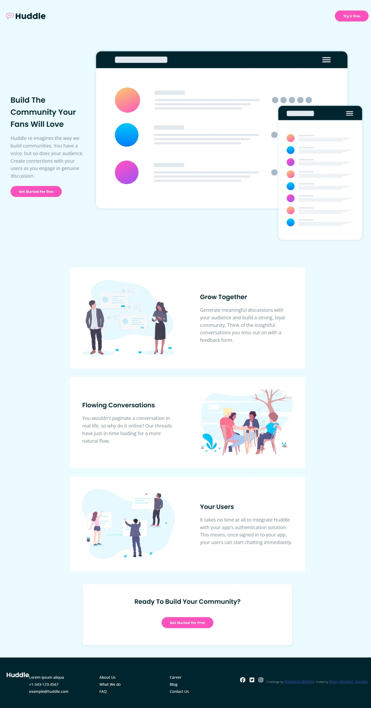

# Frontend Mentor - Huddle landing page with alternating feature blocks solution

This is a solution to the [Huddle landing page with alternating feature blocks challenge on Frontend Mentor](https://www.frontendmentor.io/challenges/huddle-landing-page-with-alternating-feature-blocks-5ca5f5981e82137ec91a5100). Frontend Mentor challenges help you improve your coding skills by building realistic projects. 

## Table of contents

- [Overview](#overview)
  - [The challenge](#the-challenge)
  - [Screenshot](#screenshot)
  - [Links](#links)
- [My process](#my-process)
  - [Built with](#built-with)
  - [What I learned](#what-i-learned)
  - [Continued development](#continued-development)
  - [Useful resources](#useful-resources)
- [Author](#author)
- [Acknowledgments](#acknowledgments)

## Overview
This Challenge was to build a responsive landing page for Huddle, a fictional service that helps users build communities. the key goals wer to:
- Build a responsive layout that adapts seamlessly between mobile (375px) and desktop (1440px)
- implement alternating features section with side-by-side layouts on larger screens 
- create accessible markup, including alt text, semantic HTML, and keyboard navigation
- Match the provided design as closely as possible using custom CSS
### The challenge

Users should be able to:

- View the optimal layout for the site depending on their device's screen size
- See hover states for all interactive elements on the page
- Navigate the site using keyboard and assistive technologies
- Understand image content via descriptive alt attributes

### Screenshot



### Links

- Solution URL: [Frontend Mentor Solution](https://www.frontendmentor.io/solutions/html-css-flexbox-font-awesome-google-fonts-poppins-and-open-sans-a-DcSxOcZ3)
- Live Site URL: [Live Preview](https://sundaymary830.github.io/landing-page/)

## My process

### Built with
- Semantic HTML5 markup
- CSS custom properties
- Flexbox
- Responsive layout (mobile-first)
- Font Awesome for icons
- Google Fonts: Poppins and Open Sans

### What I learned

This project gave me deeper experience in building fully responsive layouts with semantic HTML and Flexbox. I also focused heavily on accessibility, including:

- Correct use of heading hierarchy
- Adding `alt` descriptions to images
- Using `aria-label`s for social icons
- Ensuring all interactive elements are keyboard-accessible

Example:

```html
<a href="mailto:example@huddle.com" aria-label="Send email">
  <i class="fa-solid fa-envelope"></i> example@huddle.com
</a>
```

```css
@media (min-width: 768px) {
  .card {
    flex-direction: row;
  }

  .card.reverse {
    flex-direction: row-reverse;
  }
}
```

### Continued development

I'd like to continue improving on:

- Advanced responsive layouts with Grid for more complex layouts
- Full WCAG AA/AAA compliance
- Adding animations that don't hinder accessibility
- Testing with screen readers

### Useful resources

- [A Complete Guide to Flexbox](https://css-tricks.com/snippets/css/a-guide-to-flexbox/) - Helped refine layout structure
- [WebAIM Contrast Checker](https://webaim.org/resources/contrastchecker/) - Ensured color contrast meets accessibility guidelines
- [Font Awesome Docs](https://fontawesome.com/docs/web/use-with/html/) - For adding and labeling icons accessibly

## Author

- Website – [Mary Abiodun Sunday](https://github.com/sundaymary830)
- Frontend Mentor – [@sundaymary830](https://www.frontendmentor.io/profile/sundaymary830)
- GitHub – [@sundaymary830](https://github.com/sundaymary830)

## Acknowledgments

Thanks to the Frontend Mentor and Github community for feedback on layout and accessibility. And a big shout-out to my webdevelopment mentor for guidance on structuring the CSS and improving accessibility standards!
